<div align="center">



<br/>

[](https://angular.io)
[](https://supabase.com)
[](https://vercel.com)
[](https://groq.com)
[](https://typescriptlang.org)
[](LICENSE)

<br/>

[**🚀 Live Demo**](https://algo-arena-tavx.vercel.app) &nbsp;·&nbsp; [**🐛 Report Bug**](https://github.com/Bhavish089/AlgoArena/issues) &nbsp;·&nbsp; [**✨ Request Feature**](https://github.com/Bhavish089/AlgoArena/issues)

<br/>

> *Major Project — Diploma in Computer Science Engineering*
> *3rd Year · 6th Semester · IIMT*

</div>

---

## `>>` WHAT IS ALGOARENA?

AlgoArena is a full-stack exam platform where admins generate AI-powered quizzes from any syllabus, publish them as live sessions, and monitor candidates in real time — all from a single dashboard.

Candidates join with a session ID and password, attempt the quiz within a time limit, and get scored instantly. Admins can review every answer, override scores manually, and detect suspicious behavior via tab-switch tracking.

```
ADMIN                          CANDIDATE
  │                               │
  ├─ Generate quiz (AI)           ├─ Sign up / Login
  ├─ Edit questions               ├─ Join session (ID + password)
  ├─ Set timer & expiry           ├─ Attempt quiz (MCQ / TF / Short)
  ├─ Publish → Supabase           ├─ Auto-submit on timeout
  ├─ Watch dashboard live         └─ Get score instantly
  ├─ View candidate logs
  ├─ Override scores
  └─ Terminate session
```

---

## `>>` TECH STACK

| Layer | Technology | Purpose |
|---|---|---|
| **Frontend** | Angular 21, TypeScript, SCSS | SPA with routing + reactive UI |
| **Backend (Dev)** | Node.js, Express, Socket.IO | Local dev server with real-time |
| **Backend (Prod)** | Vercel Serverless Functions | 8 API endpoints |
| **Database** | Supabase (PostgreSQL) | Sessions, submissions, profiles |
| **Auth** | Supabase Auth | Email/password, JWT tokens, RLS |
| **AI** | Groq API — LLaMA 3.1 8B Instant | Quiz generation from syllabus |
| **Compression** | Node.js zlib (gzip) | Quiz data compressed ~80% before DB |
| **Deployment** | Vercel | Auto-deploy on push to `main` |

---

## `>>` PROJECT STRUCTURE

```
AlgoArena/
│
├── api/                          # Vercel Serverless Functions (Production)
│   ├── generate.js               # AI quiz generation via Groq
│   ├── create-session.js         # Publish quiz → Supabase
│   ├── get-sessions.js           # Fetch admin's active sessions
│   ├── get-submissions.js        # Fetch candidates' answers + scores
│   ├── join-session.js           # Candidate join + decompress quiz
│   ├── submit-exam.js            # Grade + save submission
│   ├── update-score.js           # Manual score override
│   └── terminate-session.js      # Delete session from Supabase
│
├── src/
│   ├── app/
│   │   ├── components/
│   │   │   ├── home/             # Landing page
│   │   │   ├── login/            # Auth — login
│   │   │   ├── signup/           # Auth — register
│   │   │   ├── dashboard/        # Admin control center
│   │   │   ├── examgen/          # Quiz builder
│   │   │   └── candidate/        # Exam attempt interface
│   │   ├── services/
│   │   │   └── auth.ts           # Supabase auth + session management
│   │   └── app.routes.ts         # SPA routing
│   ├── environments/
│   │   ├── environment.ts        # Production config
│   │   └── environment.development.ts
│   └── styles.css                # Global theme variables
│
├── src/server/
│   └── socket-server.js          # Express + Socket.IO (dev only)
│
├── .github/
│   └── banner.svg                # Animated README banner
├── proxy.conf.json               # Angular dev proxy → localhost:3000
├── vercel.json                   # Build config + API rewrites
└── package.json
```

---

## `>>` ARCHITECTURE

### Dev vs Production

```
┌──────────────────────────────────────────────────────┐
│  DEVELOPMENT  (npm run dev)                          │
│                                                      │
│  Browser → Angular :4200 → proxy → Express :3000    │
│                                     └─ Socket.IO     │
│                                     └─ In-memory     │
└──────────────────────────────────────────────────────┘

┌──────────────────────────────────────────────────────┐
│  PRODUCTION  (Vercel)                                │
│                                                      │
│  Browser → Angular (static build)                   │
│               └── vercel.json rewrites               │
│                     └── /api/*.js (serverless)       │
│                           └── Supabase (persistent)  │
└──────────────────────────────────────────────────────┘
```

### Quiz Generation Flow

```
Admin fills form (title, syllabus, count, timer, password)
    ↓
POST /generate → api/generate.js → Groq LLaMA 3.1 8B
    ↓
Normalize + pad to exact question count
    ↓
Angular editor → Admin edits/previews → Publish
    ↓
POST /create-session
    ├── Verify admin JWT (Supabase Auth)
    ├── Check role === 'admin' in profiles table
    ├── gzip compress quiz → base64 string
    └── INSERT into Supabase sessions table
```

### Candidate Flow

```
Enter session ID + name + password
    ↓
POST /join-session
    ├── Verify candidate JWT
    ├── Check session valid + not expired + not closed
    ├── Check password + no duplicate submission
    └── Decompress (base64 → gunzip → JSON) + return questions
    ↓
Attempt quiz — tab switches tracked automatically
    ↓
POST /submit-exam
    ├── Grade answers (case-insensitive match)
    ├── Calculate suspicion: CLEAN / MEDIUM / HIGH
    └── INSERT into submissions table
```

---

## `>>` DATABASE SCHEMA

```sql
-- User profiles (extends Supabase Auth)
profiles
  id uuid PK, email text, full_name text,
  phone text, role text CHECK('admin'|'candidate'), created_at

-- Exam sessions
sessions
  id text PK (ALGO-XXXX), owner_id uuid, title text,
  password text, validity_start timestamptz, expiry timestamptz,
  submit_timeout int, max_candidates int,
  data text (gzip+base64), closed boolean, created_at

-- Candidate submissions
submissions
  id uuid PK, session_id text, candidate_id uuid,
  answers jsonb, score int, status text,
  tab_switches int, suspicion text, time_taken int, submitted_at
```

> Quiz data is gzip compressed before storing — reduces payload ~80% (20KB → ~2KB).
> `pg_cron` auto-deletes expired sessions every 10 minutes.

---

## `>>` API REFERENCE

| Method | Endpoint | Auth | Description |
|---|---|---|---|
| `POST` | `/generate` | — | Generate quiz via Groq AI |
| `POST` | `/create-session` | Admin | Publish quiz to Supabase |
| `GET` | `/get-sessions` | Admin | Fetch active sessions |
| `GET` | `/get-submissions` | Admin | Fetch candidate submissions |
| `POST` | `/join-session` | Candidate | Validate + join session |
| `POST` | `/submit-exam` | Candidate | Grade + save answers |
| `POST` | `/update-score` | Admin | Override candidate score |
| `POST` | `/terminate-session` | Admin | Delete session |

---

## `>>` GETTING STARTED

### Prerequisites

```
Node.js 18+
Angular CLI 21
Supabase account
Groq API key
```

### Local Development

```bash
# Clone
git clone https://github.com/Bhavish089/AlgoArena.git
cd AlgoArena

# Install
npm install

# Environment — create .env and add:
# GROQ_API_KEY=your_key
# SUPABASE_URL=your_url
# SUPABASE_SERVICE_KEY=your_service_key

# Start backend (terminal 1)
npm run server

# Start frontend (terminal 2)
npm run dev
# → http://localhost:4200
```

### Environment Variables

| Variable | Used In | Description |
|---|---|---|
| `GROQ_API_KEY` | `.env` + Vercel | Groq API key for AI generation |
| `SUPABASE_URL` | `.env` + Vercel | Supabase project URL |
| `SUPABASE_SERVICE_KEY` | `.env` + Vercel | Service role key (server-side only) |

### Deploy to Vercel

```bash
git push origin main   # Vercel auto-deploys on every push
```

Add env vars in **Vercel → Settings → Environment Variables**.

---

## `>>` FEATURES

```
ADMIN                           CANDIDATE
──────────────────────          ──────────────────────
✓ AI quiz generation            ✓ Account registration
✓ Question editor               ✓ Session join flow
✓ Preview before publish        ✓ MCQ / TF / Short answer
✓ Validity + timer config       ✓ Live countdown timer
✓ Password protection           ✓ Auto-submit on expiry
✓ Live dashboard (10s poll)     ✓ Instant score display
✓ Per-candidate answer logs     ✓ Tab-switch detection
✓ Manual score override
✓ One-click terminate

PLATFORM
──────────────────────
✓ Light / Dark / High-Contrast themes
✓ Fully responsive (mobile + tablet + desktop)
✓ Role-based access (admin / candidate)
✓ Compressed quiz storage (gzip ~80% reduction)
✓ Auto-delete expired sessions (pg_cron)
✓ Duplicate submission prevention
✓ Suspicion scoring (CLEAN / MEDIUM / HIGH)
```

---

## `>>` SCRIPTS

```bash
npm run dev      # Angular dev server + Socket.IO proxy
npm run server   # Express + Socket.IO backend (dev only)
npm run build    # Production build → dist/AlgoArena-Master/browser
npm test         # Unit tests
```

---

## `>>` ROADMAP

- [ ] Group quizzes (collaborative attempt mode)
- [ ] Supabase Realtime (instant dashboard updates)
- [ ] Email notifications on session publish
- [ ] Question bank — save and reuse questions
- [ ] Analytics — score distributions, time analysis
- [ ] PDF result export
- [ ] OAuth login (Google / GitHub)

---

## `>>` TEAM

<div align="center">

| | Name | Role |
|:---:|---|---|
| 👨‍💻 | **Bhavish Agrawal** | Lead Developer — Full Stack, Architecture, Deployment |
| 👨‍💻 | **Priyanshu Pushpam** | Frontend Developer — UI/UX, Components |
| 👨‍💻 | **Ansh Singhal** | Backend Developer — API, Database |
| 👨‍💻 | **Mizbual Haque** | Developer — Testing, Integration |

<br/>

*Diploma in Computer Science Engineering*
*3rd Year · 6th Semester · Major Project*

<br/>

**IIMT College of Engineering**

</div>

---

## `>>` DOCUMENTATION

[](https://drive.google.com/file/d/1XK_o4CwQY2P_envKj-KIhnl1W39esIm-/view?usp=sharing)

## `>>` LICENSE

This project was developed as a Major Project submission at **IIMT College of Engineering**.
All rights reserved © 2026 — Bhavish Agrawal, Priyanshu Pushpam, Ansh Singhal, Mizbual Haque.

---

<div align="center">

<br/>

Built with Angular &nbsp;·&nbsp; Supabase &nbsp;·&nbsp; Groq &nbsp;·&nbsp; Vercel

<br/>

**`>> SYSTEM ONLINE — GOOD LUCK, CANDIDATES.`**

<br/>

</div>
